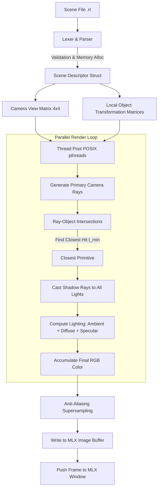

# 🌌 miniRT — 3D Ray Tracing Engine

<div align="center">


**A fast, multithreaded, mathematically rigorous 3D Ray Tracer built from scratch in C.**

[Overview](#-overview) •
[Features](#-features) •
[Ray Tracing Pipeline](#-ray-tracing-pipeline) •
[Mathematical Foundations](#-mathematical-foundations) •
[Scene Description (.rt)](#-scene-description-rt-format) •
[Compilation & Usage](#-compilation--usage) •
[Sample Scenes](#-sample-scenes) •
[Project Architecture](#-project-architecture)

</div>

---

## 📖 Overview

**miniRT** is an interactive 3D Computer Graphics rendering engine developed as part of the **42 Network / 1337** curriculum. The goal of the project is to implement ray tracing algorithms from the ground up in pure C without external mathematical or rendering libraries, translating fundamental vector calculus and physics-based optics into computer-generated imagery.

The engine casts mathematical rays through a virtual pinhole camera into a 3D coordinate space, computes analytical intersections with geometric primitives (spheres, planes, finite cylinders, and cones), resolves occlusion for hard shadows, calculates lighting using the **Phong Illumination Model**, and displays the rendered frame using **MiniLibX**.

---

## ✨ Features

### 🎯 Mandatory Primitives & Illumination
- **Geometric Primitives**:
  - 🔴 **Spheres (`sp`)**: Closed quadratic surfaces with exact normal calculation.
  - ⬜ **Planes (`pl`)**: Infinite planar surfaces defined by a position and normal vector.
  - 🥫 **Cylinders (`cy`)**: Finite cylinders with arbitrary 3D orientation, bounded along their central axis and closed with flat circular end-caps.
- **Lighting & Optics**:
  - ☀️ **Ambient Lighting (`A`)**: Global omnidirectional illumination with customizable color and intensity ratio.
  - 💡 **Diffuse Lighting (Lambertian)**: Surface illumination proportional to the angle between the surface normal and the light vector ($\cos\theta$).
  - 🌑 **Hard Shadows**: Accurate shadow rays tested from intersection points to light sources, featuring epsilon bias to prevent shadow acne and self-occlusion.
- **Virtual Camera**:
  - Full 3D translation and arbitrary orientation vector.
  - Adjustable Field of View (FOV: $0^\circ$ to $180^\circ$).
  - Homogeneous $4 \times 4$ transformation matrices for world-to-camera coordinate space conversion.

### 🚀 Bonus Enhancements
- **⚡ Multithreaded Rendering**:
  - Leverages POSIX threads (`pthread`) to slice the rendering workload into 10 concurrent threads, drastically accelerating render times for high-complexity scenes.
- **✨ Specular Highlights (Phong Reflection Model)**:
  - Realistic surface highlights based on the viewer's angle and reflected light direction ($(\vec{R} \cdot \vec{V})^\alpha$ with shininess factor $\alpha = 50$).
- **💡 Multiple Point Light Sources**:
  - Supports multiple arbitrary light sources (`L`) with additive radiance per pixel and intersecting shadow contributions.
- **🔺 Cone Primitive (`co`)**:
  - Finite cones with arbitrary position, direction vector, base diameter, and height, capped with a planar base disk.
- **🔍 Anti-Aliasing / Supersampling (AA)**:
  - Sub-pixel recursive supersampling (`make optim` / `make boptim`) that samples multiple sub-ray directions per pixel to eliminate aliasing and jagged edges.

---

## 🔄 Ray Tracing Pipeline

The diagram below outlines the execution flow of **miniRT**:



---

## 📐 Mathematical Foundations

### 1. Camera Projection & Transformation Matrices
To handle arbitrary camera orientations, world coordinates are converted into camera coordinates using a $4 \times 4$ homogeneous transformation matrix $M$:

$$
M = \begin{bmatrix} \vec{R}_x & \vec{R}_y & \vec{R}_z & \vec{T} \\ 0 & 0 & 0 & 1 \end{bmatrix}^{-1}
$$

The inverse transformation matrix is computed analytically via the **Adjugate Matrix** and **Determinant**:

$$
M^{-1} = \frac{1}{\det(M)} \, \text{adj}(M)
$$

For each pixel $(x, y)$ on a $1000 \times 1000$ viewport:

$$
\vec{P}_{\text{screen}} = \left( x \cdot \Delta_{\text{step}} - \frac{W}{2}, \; \frac{H}{2} - y \cdot \Delta_{\text{step}}, \; f_{\text{fov}} \right)
$$

---

### 2. Analytical Primitive Intersections

#### 🔴 Sphere Intersection
A ray defined by $\vec{P}(t) = \vec{O} + t\vec{D}$ and a sphere of radius $r$ centered at $\vec{C}$:

$$
\|\vec{P}(t) - \vec{C}\|^2 = r^2
$$

Expanded into the quadratic equation $at^2 + bt + c = 0$:
- **$a$** $= \vec{D} \cdot \vec{D}$
- **$b$** $= 2 \left( \vec{D} \cdot (\vec{O} - \vec{C}) \right)$
- **$c$** $= (\vec{O} - \vec{C}) \cdot (\vec{O} - \vec{C}) - r^2$

The discriminant $\Delta = b^2 - 4ac$ determines intersections:
- $\Delta < 0$: No intersection.
- $\Delta \ge 0$: $t = \frac{-b \pm \sqrt{\Delta}}{2a}$ (select minimum positive $t$).

#### ⬜ Plane Intersection
A plane with position point $\vec{P}_0$ and normal vector $\vec{N}$:

$$
(\vec{P}(t) - \vec{P}_0) \cdot \vec{N} = 0 \implies t = \frac{(\vec{P}_0 - \vec{O}) \cdot \vec{N}}{\vec{D} \cdot \vec{N}}
$$

#### 🥫 Finite Cylinder Intersection
The cylinder is transformed into local object space where its symmetry axis aligns with the $Z$-axis. The intersection collapses into a 2D circle problem:

$$
(D_x t + O_x)^2 + (D_y t + O_y)^2 = r^2
$$

The solution $t$ is verified against the height constraint along $Z$:

$$
|P_z(t)| \le \frac{h}{2}
$$

Flat circular end caps at $z = \pm \frac{h}{2}$ are solved as finite planar disks.

#### 🔺 Finite Cone Intersection (Bonus)
A right circular cone with half-angle $\theta = \arctan(r / h)$ and apex in local space:

$$
D_x^2 + D_y^2 - m \cdot D_z^2 = 0 \quad \text{where } m = \frac{r^2}{h^2}
$$

Constrained between apex and base disk: $0 \le P_z(t) \le h$.

---

### 3. Phong Shading Model
The total observed radiance $I$ at a hit point $\vec{P}$ is the sum of ambient, diffuse, and specular reflections across all unoccluded light sources:

$$
I = k_a I_a + \sum_{i \in \text{Lights}} \left[ k_d (\vec{N} \cdot \vec{L}_i) I_{d, i} + k_s (\vec{R}_i \cdot \vec{V})^\alpha I_{s, i} \right]
$$

- **Ambient ($I_a$)**: Uniform base illumination.
- **Diffuse ($I_d$)**: Lambertian reflection based on angle between surface normal $\vec{N}$ and incident light $\vec{L}_i$.
- **Specular ($I_s$)**: Reflected ray $\vec{R} = 2(\vec{N} \cdot \vec{L})\vec{N} - \vec{L}$ dotted with view vector $\vec{V}$ raised to shininess exponent $\alpha = 50$.
- **Shadow Ray Test**: If a ray cast from $\vec{P} + \epsilon\vec{N}$ toward $\vec{L}_i$ intersects any geometry before reaching the light, diffuse and specular contributions from light $i$ are zero.

---

## 📄 Scene Description (.rt) Format

Scene files describe the virtual environment using simple space-separated text entries.

### Element Specifications

| Element | ID | Parameters | Constraints | Example |
|---|:---:|---|---|---|
| **Ambient Light** | `A` | `[ratio] [R,G,B]` | ratio $\in [0.0, 1.0]$, RGB $\in [0, 255]$ | `A 0.2 255,255,255` |
| **Camera** | `C` | `[x,y,z] [dir_x,dir_y,dir_z] [FOV]` | dir normalized $\in [-1.0, 1.0]$, FOV $\in [0, 180]$ | `C 0,0,-30 0,0,1 80` |
| **Light Source** | `L` | `[x,y,z] [brightness] [R,G,B]` | brightness $\in [0.0, 1.0]$, RGB $\in [0, 255]$ | `L -25,20,-30 0.6 255,255,255` |
| **Sphere** | `sp` | `[x,y,z] [diameter] [R,G,B]` | diameter $> 0$, RGB $\in [0, 255]$ | `sp 0,0,20 12.5 255,0,0` |
| **Plane** | `pl` | `[x,y,z] [norm_x,norm_y,norm_z] [R,G,B]` | normal normalized $\in [-1.0, 1.0]$ | `pl 0,-10,0 0,1,0 120,255,255` |
| **Cylinder** | `cy` | `[x,y,z] [dir_x,dir_y,dir_z] [dia] [height] [RGB]` | diameter, height $> 0$ | `cy 0,-15,-40 0,1,0.5 20 15 255,0,0` |
| **Cone (Bonus)** | `co` | `[x,y,z] [dir_x,dir_y,dir_z] [dia] [height] [RGB]` | diameter, height $> 0$ | `co 0,15,-2 0,-1,0 14 14 253,144,120` |

### Sample Scene: `cone_cy_art.rt`
```ini
A 0.3 255,255,255
L -20,0,-45 0.7 255,255,255
L 10,0,-45 0.7 255,255,255
C 0,0,-30 0,0,1 80

pl 0,-10,0 0,1,0 128,0,255
co 0,15,-2 0,-1,0 14 14 253,144,120
co 0,20,-2 0,-1,0 10 7 253,144,120
cy 0,8,-2 0,-1,0 10 10 253,144,120
cy 0,-2.5,-2 0,-1,0 14 7 253,144,120
```

> **Note on Parsing**: The parser strictly validates input format, numerical ranges, commas, whitespace, and prevents invalid or duplicate singleton items (such as multiple cameras).

---

## 🛠️ Compilation & Usage

### 📦 Prerequisites
- **Compiler**: `clang` or `gcc`
- **Build System**: `make`
- **Libraries**:
  - `MiniLibX` (OpenGL and AppKit frameworks on macOS, or X11/Xext on Linux)
  - `pthread` (POSIX Threads)
  - `math` library (`-lm`)

### ⚙️ Build Targets

| Command | Description |
|---|---|
| `make` / `make all` | Compiles the standard **Mandatory** engine (`miniRT`). |
| `make optim` | Compiles Mandatory with **4x Supersampling Anti-Aliasing**. |
| `make bonus` | Compiles the **Bonus** engine (multithreading, multi-light, cones, Phong specular highlights). |
| `make boptim` | Compiles Bonus with **Multithreading + Supersampling Anti-Aliasing**. |
| `make clean` | Removes compiled object files. |
| `make fclean` | Cleans objects and deletes the `miniRT` binary. |
| `make re` | Recompiles the entire project from scratch. |

### 🚀 Running the Engine

Provide any valid `.rt` scene file as a command-line argument:

```bash
# Render mandatory scene
./miniRT maps/cylinder.rt

# Render bonus scene with multiple lights and cones
make bonus
./miniRT maps/cone_cy_art.rt

# Render high-fidelity scene with Anti-Aliasing
make boptim
./miniRT maps/cornellbox.rt
```

### 🎮 Controls
- **`ESC`** (Keycode 53): Closes the window and frees all allocated memory cleanly.
- **Window Close Button (`[X]`)**: Performs a graceful exit.

---

## 🎨 Sample Scenes

The repository comes with preconfigured scenes in [`maps/`](maps/) demonstrating different rendering features:

- 🏛️ [`maps/cornellbox.rt`](maps/cornellbox.rt) — The classic Cornell Box testing environment for shadows, lighting, and geometric alignment.
- 🏰 [`maps/aladin_room.rt`](maps/aladin_room.rt) — Complex multi-object scene showcasing interior lighting.
- 🌲 [`maps/map_trees.rt`](maps/map_trees.rt) — Compound object modeling utilizing cylinders and spheres.
- 🤖 [`maps/android.rt`](maps/android.rt) — Stylized android figure created from geometric primitives.
- 🍦 [`maps/cone_cy_art.rt`](maps/cone_cy_art.rt) — Multi-light setup demonstrating cones, cylinders, and specular reflection.

---

## 📂 Project Architecture

```plaintext
42_miniRt/
├── Makefile                          # Build script with mandatory, bonus, and AA targets
├── includes/                         # Header files
│   ├── defines.h                     # Error codes, key codes, and global definitions
│   ├── elements.h                    # 3D vector, RGB, and primitive data structures
│   └── minirt.h                      # Function prototypes and rendering definitions
├── libft/                            # Custom C standard library utilities
├── maps/                             # Preconfigured .rt scene files
│   ├── maps1/                        # Additional complex test scenes (Cornell Box, etc.)
│   └── ...
└── src/
    ├── minirt.c                      # Entry point, window setup, and event hooks
    ├── parsing/                      # Scene parser & grammar validation
    │   ├── check_A_C_L_elements.c    # Parsing ambient, camera, and light definitions
    │   ├── check_cone_element_bonus.c# Parsing cone parameters (Bonus)
    │   ├── check_element.c           # Element dispatch & routing
    │   ├── check_pl_sp_cy_elements.c # Parsing plane, sphere, and cylinder definitions
    │   ├── parse_elements_utils.c    # Coordinate tuples, RGB, and float string parsers
    │   ├── print_error_msg.c         # Formatted stderr error feedback
    │   └── read_map.c                # File reader and line-by-line scene tokenizer
    └── display/                      # Mathematical engine & raytracer pipeline
        ├── cogo_manipulations.c      # Coordinate updates & 4x4 transform applications
        ├── matrix_opp.c              # 4x4 matrix inverse, transpose, and determinant
        ├── fill_matrix.c             # Camera & object orientation matrix constructors
        ├── vectors_opp.c             # 3D Vector math (dot product, magnitude, scaling)
        ├── vectors_opp_2d.c          # 2D Vector operations for cylinder/cone projection
        ├── sphere_inter.c            # Quadratic ray-sphere intersection tests
        ├── plane_inter.c             # Ray-plane algebraic intersection
        ├── cylinder_inter.c          # Local-space ray-cylinder intersection & height bounds
        ├── disks_inter.c             # Circular cap disk intersections
        ├── cone_inter_bonus.c        # Quadratic ray-cone intersection tests (Bonus)
        ├── cone_shading_bonus.c      # Normal vector & shading for cones (Bonus)
        ├── check_shadow_ray.c        # Shadow ray occlusion & light visibility tests
        ├── objects_shading.c         # Lambertian diffuse & ambient color evaluation
        ├── add_specular_light_bonus.c# Phong specular highlight calculations (Bonus)
        ├── pthread_display_bonus.c   # Multithreaded scanline distribution (Bonus)
        ├── get_pixel_color.c         # Single-sample pixel color evaluation
        ├── get_pixel_color_optimised.c# 4x Recursive supersampling anti-aliasing
        ├── rendring_mandatory.c      # Single-threaded rendering loop
        └── rendring_bonus.c          # Multi-light accumulative rendering loop
```

---

<div align="center">
<sub>Crafted with mathematics, C, and ray optics at 1337 / 42 Network.</sub>
</div>
